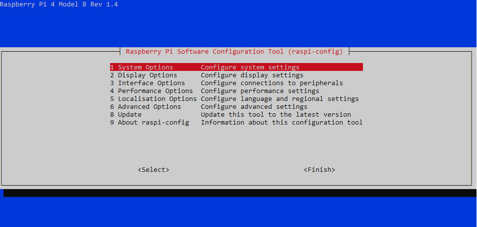
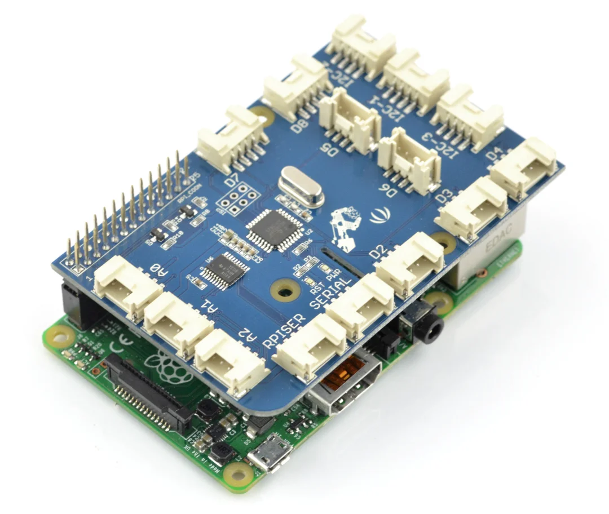
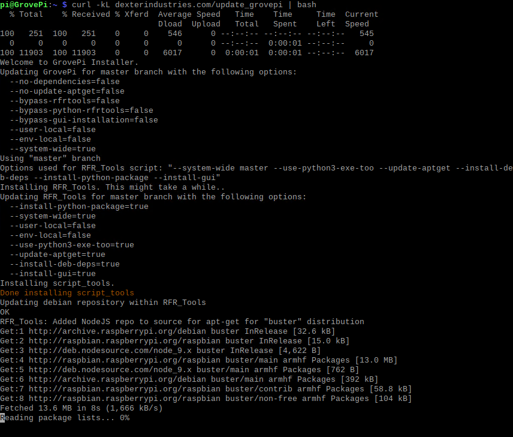
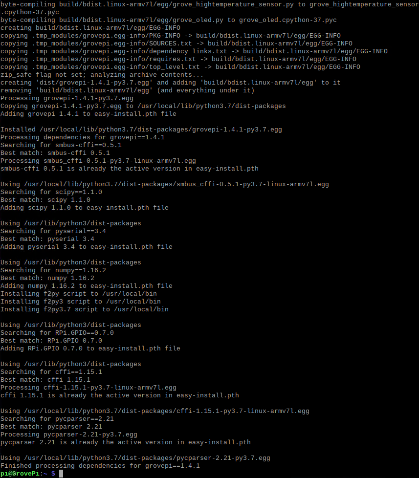
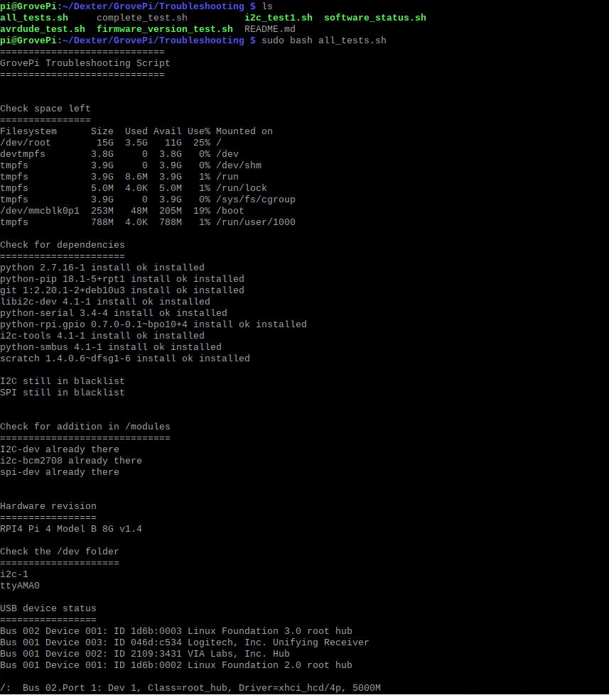
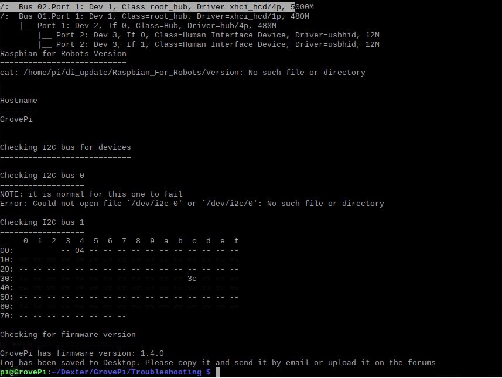

# Lab 1: Set up developement environment
---

## 1. Prerequisites:

- Raspberry Pi 3B/4B, 1GB+ RAM, 16GB+ SD card
- Grove Pi+
- SD card reader - USB interface
- Raspberry Pi OS Imager

## 2. Download Raspbian OS

Download the latest Raspbian OS **Buster 32-bit** from official website.
https://downloads.raspberrypi.org/raspios_armhf/images/raspios_armhf-2021-05-28/
	
Use the `Raspberry Pi OS Imager` to flash the OS to the SD card.

Once it's successfully written and verified, you may remove the SD card and insert it into your Raspberry Pi.

In this series of labs, I will be using a Raspberry Pi 4B, and will use RPi to refer to Raspberry Pi afterwards.

## 3. Boot up and configure the RPi

You may use `Raspsberry Pi Software Configuration Tool` tool to configure your RPi. It's a powerful tool which can be run in command line mode and provides a straightforward way of doing initial configuration of the Raspberry Pi. 

`$ sudo raspi-config`

  

### 3.1 Change password and hostname

Go to `1 System Options` -> `S3 Password` -> `S4 Hostname`. 

I changed my RPi hostname to `GrovePi`.

### 3.2 Change interface

Enable SSH, VNC, SPI and I2C.
Go to `3 Interface Options` -> `P2 SSH` -> `P3 VNC` -> `P4 SPI` -> `P5 I2C`.

You may also enable other features, but that's what we need for now.

BTW, if you are running a Raspbian OS with desktop, you may also do this by clicking `Raspberry Pi logo` -> `Preferences` -> `Raspberry Pi Configuration` and enable those features.

## 4. Install the GrovePi+

### 4.1 Standard installation
If you haven't mounted the GrovePi+ to your RPi like below, please do so. 

 

 The easiest way to install GrovePi repo, required libraries, tools and dependencies is to run below command.

```
$ curl -kL dexterindustries.com/update_grovepi | bash
```

It may take a few minutes depending on your network. The installtion process is like this:





### 4.2 Minimal installation

If you just want to go with the minimal installation of GrovePI, you can run below command:

```
$ curl -kL dexterindustries.com/update_grovepi | bash -s -- --bypass-gui-installation
```

## 5. Verify and troubleshoot

Run below scripts to verify the installation.

```
$ cd ~/Dexter/GrovePi/Troubleshooting
$ sudo bash all_test.sh
```

Below info are verified and is output to the desktop as a file called log.txt.
- Space left
- Dependencies
- I2C and SPI status
- Addition in modules
- Hardware version
- /dev folder
- USB devices
- Hostname
- I2C bus for devices
- Firmware version





`<THE END of Lab1>`