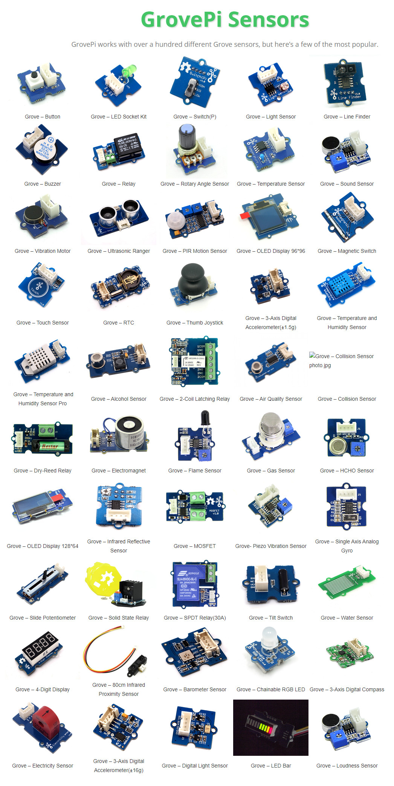
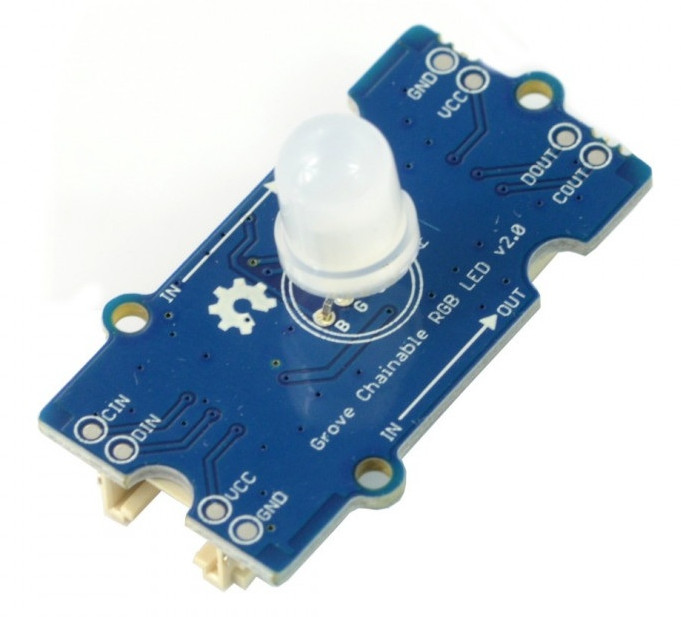
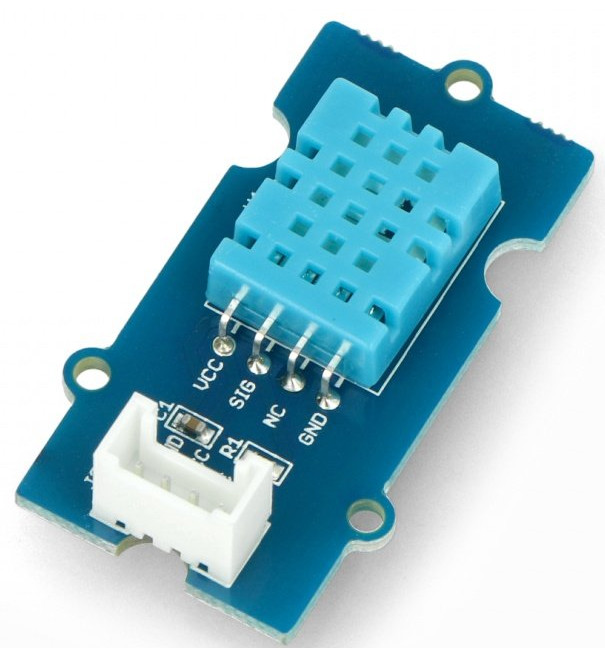
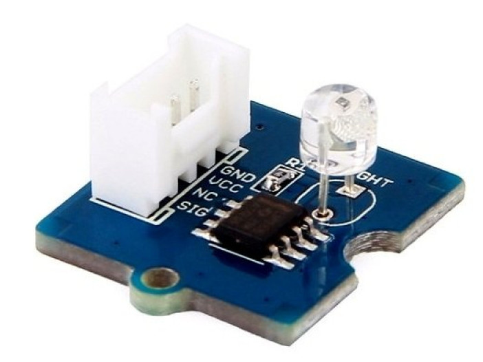
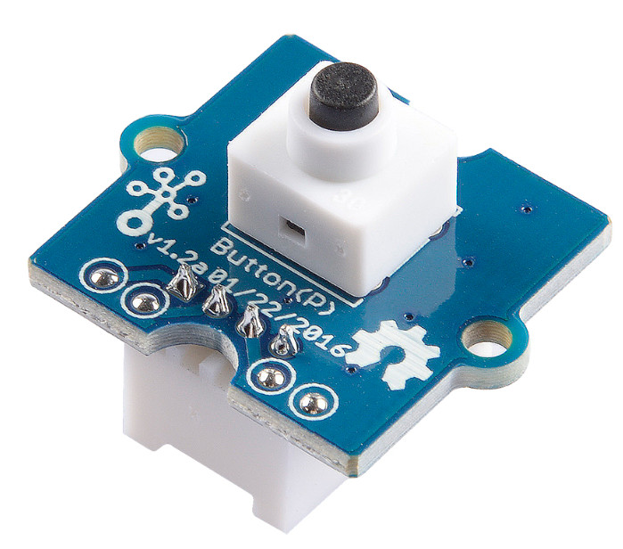
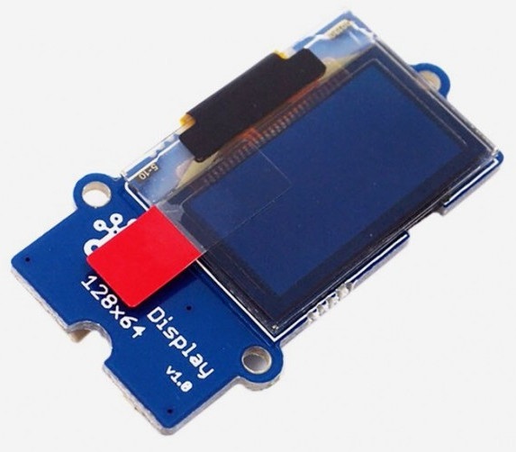
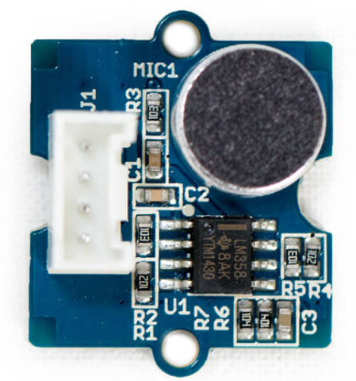
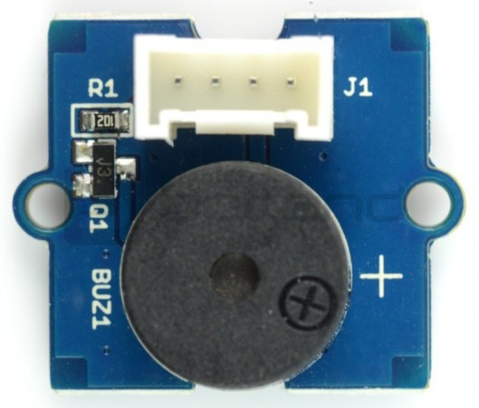

# Lab 2: Connect IoT Sensors to GrovePi+
---

GrovePi+ supports over a hundred of different types of Grove IoT sensors. Here are some popular ones.

In this series, I will use below 7 sensors.

- Grove Chainable RGB LED
  

- Grove Temperature and Humidy Sensor (DHT11)
  

- Gove Light Sensor
  

- Grove Button
  

- Grove OLED Dislay
  

- Grove Sound Sensor
  

- Grove Buzzer
  
  
All of them can be purchased from SEEED website. You may choose some of them to do the labs.

`<THE END of Lab2>`

