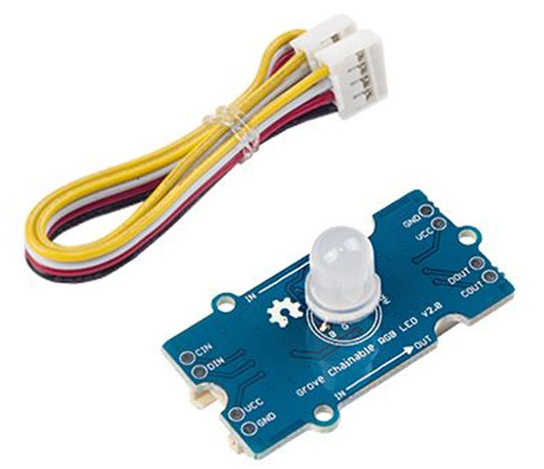

# Lab 2.a: Work with Grove Chainable RGB LED
----------------------------

## 1. Prerequisites

- Lab1 is completed. If you haven't, please do so.
- Raspberry Pi 3/4
- GrovePi+
- **Grove Chainable RGB LED** v2.0 with 4-pin wire cable

  

	**Grove Chainable RGB LED** is based on P9813 chip which is a full-color LED driver. It provides 3 constant-current drivers as well as modulated output of 256 shades of gray. It communicates with a MCU using 2-wire transmission (Data and Clock). This 2-wire transmission can be used to cascade additional Grove - Chainable RGB LED modules. The built-in clock regeneration enhances the transmission distance. This Grove module is suitable for any colorful LED based projects.


## 2. Connect teh Chainable LED to D7 port

You may connect multiple Chainable LEDs together using the provided 4-pin wire cable. I only have one chainable RGB LED, but you can connect up to 10 LEDs to make an LED chain.

  


The cable connects from the `IN` port of Chainable RGB LED to the `D7` port of GrovePi.

  


## 3. Methods for Chainable RGB LED

Below methods are used in the GrovePi module.

Calling by `grovepi.methodname()`:

- **storeColor(red, green, blue)**
  - Red, green, blue values range [0, 255]
  - Red = (255, 0, 0)
  - Green = (0, 255, 0)
  - Blue = (0, 0, 255)
        
- **chainableRgbLed_init(pin, numLeds)**

- **chainableRgbLed_test(pin, numLeds, testColor)**
    test colors used in grovepi.chainableRgbLed_test()
    □ testColorBlack = 0   # 0b000 #000000
    □ testColorBlue = 1    # 0b001 #0000FF
    □ testColorGreen = 2   # 0b010 #00FF00
    □ testColorCyan = 3    # 0b011 #00FFFF
    □ testColorRed = 4     # 0b100 #FF0000
    □ testColorMagenta = 5 # 0b101 #FF00FF
    □ testColorYellow = 6  # 0b110 #FFFF00
    □ testColorWhite = 7   # 0b111 #FFFFFF
- **chainableRgbLed_pattern(pin, pattern, whichLed)**
    patterns used in grovepi.chainableRgbLed_pattern()
    □ thisLedOnly = 0
    □ allLedsExceptThis = 1
    □ thisLedAndInwards = 2
    □ thisLedAndOutwards = 3
    Be noted I only have one LED so I won't test pattern 1, 2, and 3.

- **chainableRgbLed_modulo(pin, offset, divisor)**
- **chainableRgbLed_setLevel(pin, level, reverse)**
	
As mentioned, I only have one chainable LED so I am going to make it simple in this lab. 

## 4. Write test codes and run.

Create a directory and file to store the codes.
```
$ mkdir ~/labs/
$ mkdir ~/labs/grove_chainable_rgb_led/
$ cd ~/labs/grove_chainable_rgb_led
$ touch test_grove_led.py
$ nano test_grove_led.py
```

Add below codes in the text editor and save it.


```
# test Grove Chainable LED
# by Tim Zhan

import time
import grovepi

# I have only one LED so just connect it to the D7 port of GrovePi
pin = 7
numleds = 1    #If you have x LEDs, change 1 to x.

grovepi.pinMode(pin,"OUTPUT")
time.sleep(1)

# test colors used in grovepi.chainableRgbLed_test()
testColorBlack = 0   # 0b000 #000000
testColorBlue = 1    # 0b001 #0000FF
testColorGreen = 2   # 0b010 #00FF00
testColorRed = 4     # 0b100 #FF0000

# patterns used in grovepi.chainableRgbLed_pattern()
thisLedOnly = 0

try:
    # initialize chain of leds
    print("Initialize the chinable RGB led ...")
    grovepi.chainableRgbLed_init(pin, numleds)
    time.sleep(.5)

    # change color to RED
    print("Change color to red ...")
    grovepi.chainableRgbLed_test(pin, numleds, testColorRed)
    time.sleep(1)

    # change color to GREEN
    print("Change color to green ...")
    grovepi.chainableRgbLed_test(pin, numleds, testColorGreen)
    time.sleep(1)

    # change color to BLUE
    print("Change color to blue ...")
    grovepi.chainableRgbLed_test(pin, numleds, testColorBlue)
    time.sleep(1)

    # reset (all off)
    grovepi.chainableRgbLed_test(pin, numleds, testColorBlack)
    time.sleep(.5)

except KeyboardInterrupt:
    # reset (all off)
    grovepi.chainableRgbLed_test(pin, numleds, testColorBlack)
except IOError:
    print ("Error")
```

Run the code.
```
python test_grove_led.py
```

The result is as below. You will see the RGB LED is changing color from red to green and then to blue and black.


## 5. Source code reference

This source code for this lab can be dwonloaded from [HERE](Grove_Chainable_RGB_Led/test_grove_led.py).


`<THE END of Lab2.a>`


