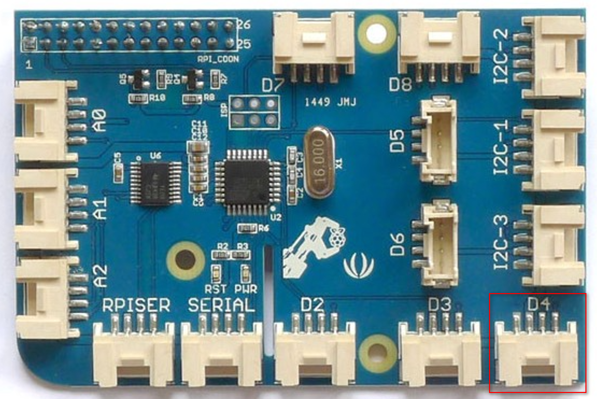
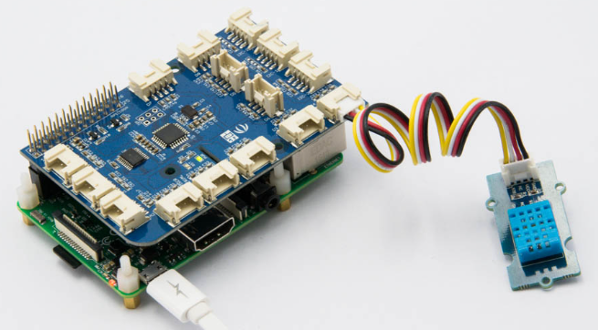
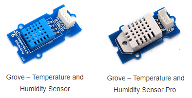
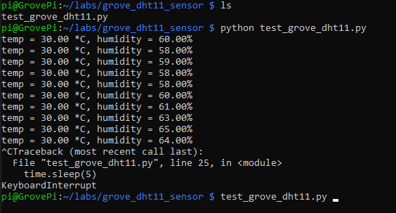

# Lab 2.b: Work with Grove Temperature & Humidity Sensor (DHT11)
---

## 1. Prerequisites

- Lab1 is completed. If you haven't, please do so.
- Raspberry Pi 3/4
- GrovePi+
- **Grove Temperature and Humidity Sensor** v1.2 with 4-pin cable
  
  

    The Grove Temperature & Humidity sensor v1.2 (DHT11) provides a pre-calibrated digital output. A unique capacitive sensor element measures relative humidity and the temperature is measured by a negative temperature coefficient (NTC) thermistor. It has excellent reliability and long term stability. Please note that this sensor will not work for temperatures below 0 degree.

## 2. Connect DHT11 to D4 port of GrovePi+

Use the 4-pin cable to connect the DHT11 sensor to `D4` port of GrovePi+.

  

  

## 3. Write your own codes and run

GrovePi+ supports two types of DHT sensors. The blue one is called `DHT11`, the white one is called `DHT Pro`.



I only have the blue one (DHT11), so I will use this one in the lab.

Create a directory and file to store the codes.
```
$ mkdir ~/labs/grove_dht11_sensor/
$ cd ~/labs/grove_dht11_sensor/
$ touch test_dht11_sensor.py
$ nano test_dht11_sensor.py
```

Add below codes in the text editor and save it.

```
# test DHT11 sensor
# by Tim Zhan

import grovepi
import time
import math

# Connect the Grove DHT11 (blue) to digital port D4

# SIG,NC,VCC,GND
sensor = 4  # The Sensor goes on digital port 4.

# temp_humidity_sensor_type
# Grove Base Kit comes with the blue sensor.
blue = 0    # The Blue colored sensor.
white = 1   # The White colored sensor.

while True:
    try:
        # This example uses the blue colored sensor. 
        # The first parameter is the port, the second parameter is the type of sensor.
        [temp,humidity] = grovepi.dht(sensor,blue)  
        if math.isnan(temp) == False and math.isnan(humidity) == False:
            print("temp = %.02f *C, humidity = %.02f%%"%(temp, humidity))
	time.sleep(5)

    except IOError:
        print ("Error")
```

Run the codes.

```
python grove_dht11_sensor.py
```



## 4. Reference source codes

You may download the reference codes from [HERE](Grove_Temperature&Humidity_Sensor/test_grove_dht11.py).

`<THE END of Lab 2.b>`


