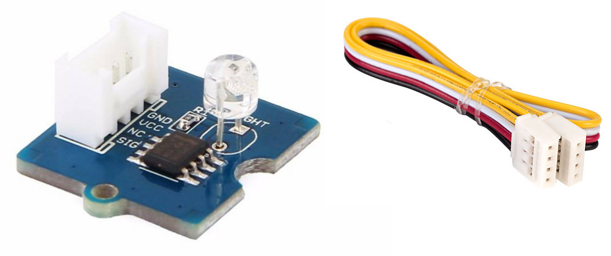
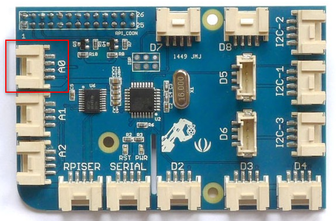
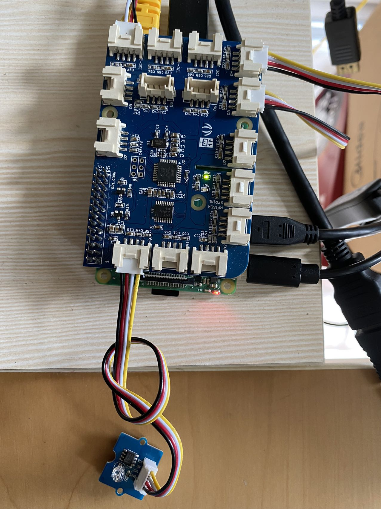
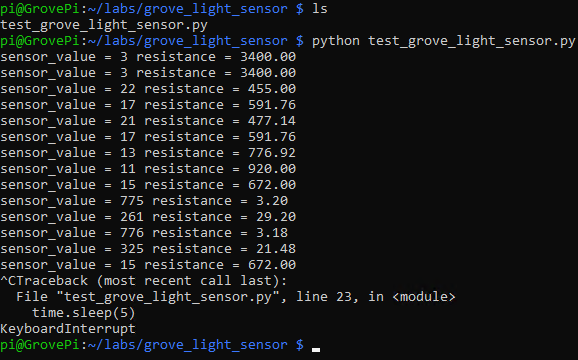

# Lab 2.c: Work with Grove Light Sensor
---

## 1. Prerequisites

- Lab1 is completed. If you haven't, please do so.
- Raspberry Pi 3/4
- GrovePi+
- **Grove Light Sensor** with 4-pin cable

  

    The Grove Light Sensor integrates a photo-resistor (light dependent resistor) to detect the intensity of light. The resistance of photo-resistor decreases when the intensity of light increases. A dual OpAmp chip LM358 on board produces voltage corresponding to intensity of light(i.e. based on resistance value). The output signal is analog value, the `brighter` the light is, the `larger` the value.


## 2. Connect Grove Light Sensor to A0 port

Use the 4-pin cable to connect the Grove Light Sensor to the A0 port of GrovePi+.

  

  

## 3. Write some test codes and run

Create a directory and a file to store the codes.
```
$ mkdir ~/labs/grove_light_sensor/
$ cd ~/labs/grove_light_sensor/
$ touch test_grove_light_sensor.py
$ nano test_grove_light_sensor.py
```

Add below codes in the text editor.

```
# test Grove Light Sensor
# by Tim Zhan

import time
import grovepi

# Connect the Grove Light Sensor to analog port A0
# SIG,NC,VCC,GND
light_sensor = 0

grovepi.pinMode(light_sensor,"INPUT")

while True:
    try:
        # Get sensor value
        sensor_value = grovepi.analogRead(light_sensor)

        # Calculate resistance of sensor in K
        resistance = (float)(1023 - sensor_value) * 10 / sensor_value

        print("sensor_value = %d resistance = %.2f" %(sensor_value,  resistance))
        time.sleep(5)

    except IOError:
        print ("Error")
```

Run the codes.
```
python test_grove_light_sensor.py
```



## 4. Reference codes

The sample test codes can be downloaded from [HERE](Grove_Light_Sensor/test_grove_light_sensor.py).

`<The END of Lab2.c>`
