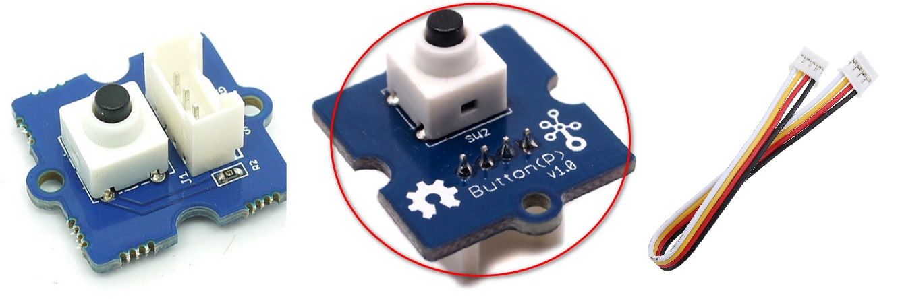

# Lab 2.d: Work with Grove Button
---

## 1. Prerequisites

- Lab1 is completed. If you haven't, please do so.
- Raspberry Pi 3/4
- GrovePi+
- **Grove Button**

  

  Grove - Button is a momentary push button. It contains one independent "momentary on/off" button. “Momentary” means that the button rebounds on its own after it is released. The button outputs a HIGH signal when pressed, and LOW when released. The Sig marked on silk layer stands for signal while NC stands for not used at all. There are two versions of this button available as showed in the pictures. The only difference is the direction of the Grove socket.


## 2. Connect Grove Light Sensor to D3 port

Use the 4-pin cable to connect the Grove Light Sensor to the D3 port of GrovePi+.

  

  

## 3. Write some test codes and run

Create a directory and a file to store the codes.
```
$ mkdir ~/labs/grove_button/
$ cd ~/labs/grove_button/
$ touch test_grove_button.py
$ nano test_grove_button.py
```

Add below codes in the text editor.

```
# test Grove Button
# by Tim Zhan

import time
import grovepi

# Connect the Grove Button to digital port D3
# SIG,NC,VCC,GND
button = 3

grovepi.pinMode(button,"INPUT")

print("Try to press the button ...")

while True:
    try:
	result = grovepi.digitalRead(button)
	if result == 1:  
		print('Button is pressed!')
        time.sleep(0.2)

    except IOError:
        print ("Error")
```

Run the codes.
```
python test_grove_button.py
```


## 4. Reference codes

The sample test codes can be downloaded from [HERE](Grove_Button/test_grove_button.py).


`<The END of Lab2.d>`
