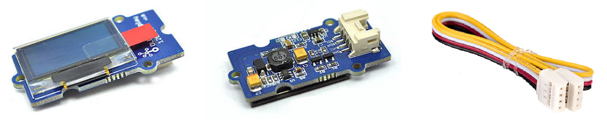
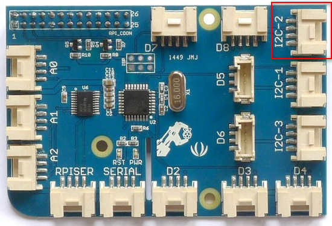
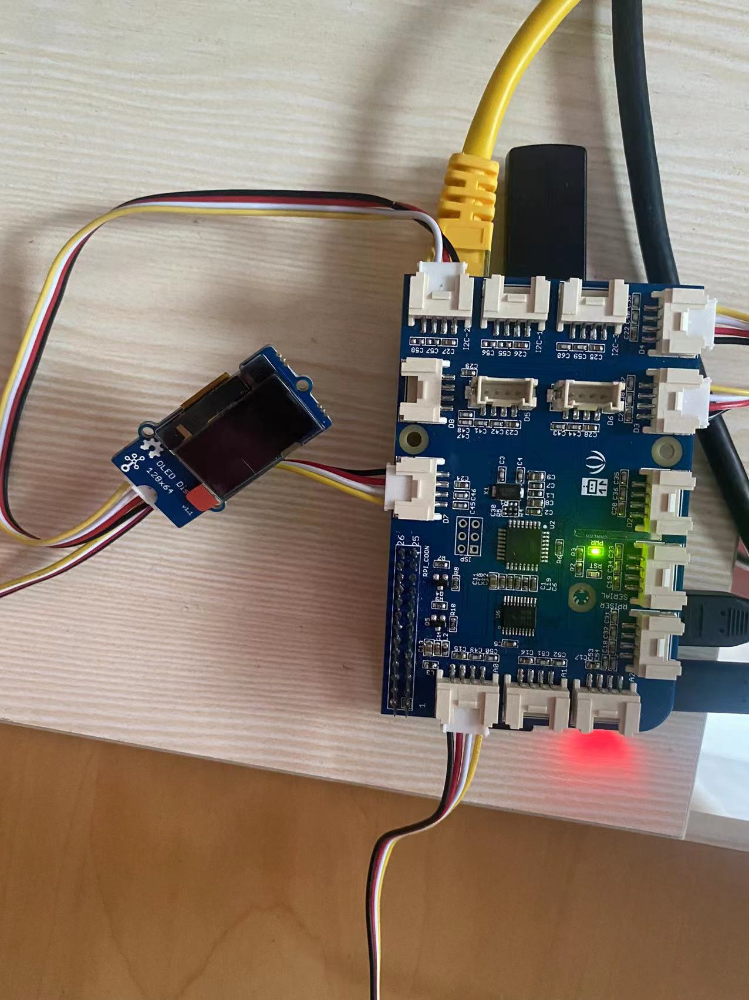
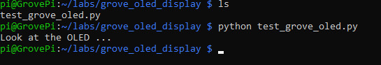
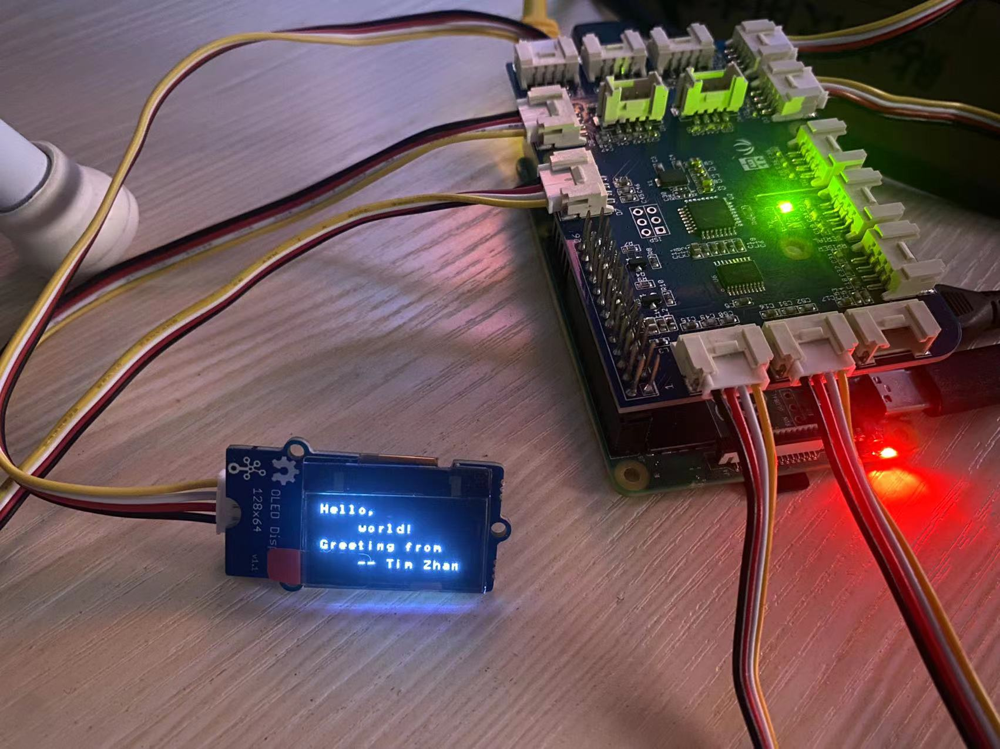

# Lab 2.e: Work with Grove OLED Display
---

## 1. Prerequisites

- Lab1 is completed. If you haven't, please do so.
- Raspberry Pi 3/4
- GrovePi+
- **Grove OLED Display**

  

  Grove OLED Display 0.96" module is an OLED monochrome 128×64 dot matrix display module with Grove 4-pin `I2C` Interface. Comparing to LCD, OLED screens are more competitive, which has a number of advantages such as high brightness, self-emission, high contrast ratio, slim / thin outline, wide viewing angle, wide temperature range, and low power consumption. It has bigger screen so that it can display more contents than the OLED 96×96.


## 2. Connect Grove OLED Display to I2C-2 port

Use the 4-pin cable to connect the Grove OLED Display to the `I2C-2` port of GrovePi+.

  

  

## 3. Write some test codes and run

Create a directory and a file to store the codes.
```
$ mkdir ~/labs/grove_oled_display/
$ cd ~/labs/grove_oled_display/
$ touch test_grove_oled.py
$ nano test_grove_oled.py
```

Add below codes in the text editor.

```
# test Grove OLED display 128x64
# by Tim Zhan

import time
import smbus2 as smbus
 
_COMMAND_MODE = 0x80
_DATA_MODE = 0x40
_NORMAL_DISPLAY = 0xA6
 
_DISPLAY_OFF = 0xAE
_DISPLAY_ON = 0xAF
_INVERSE_DISPLAY = 0xA7
_SET_BRIGHTNESS = 0x81
 
BasicFont = [[0x00, 0x00, 0x00, 0x00, 0x00, 0x00, 0x00, 0x00],
             [0x00, 0x00, 0x5F, 0x00, 0x00, 0x00, 0x00, 0x00],
             [0x00, 0x00, 0x07, 0x00, 0x07, 0x00, 0x00, 0x00],
             [0x00, 0x14, 0x7F, 0x14, 0x7F, 0x14, 0x00, 0x00],
             [0x00, 0x24, 0x2A, 0x7F, 0x2A, 0x12, 0x00, 0x00],
             [0x00, 0x23, 0x13, 0x08, 0x64, 0x62, 0x00, 0x00],
             [0x00, 0x36, 0x49, 0x55, 0x22, 0x50, 0x00, 0x00],
             [0x00, 0x00, 0x05, 0x03, 0x00, 0x00, 0x00, 0x00],
             [0x00, 0x1C, 0x22, 0x41, 0x00, 0x00, 0x00, 0x00],
             [0x00, 0x41, 0x22, 0x1C, 0x00, 0x00, 0x00, 0x00],
             [0x00, 0x08, 0x2A, 0x1C, 0x2A, 0x08, 0x00, 0x00],
             [0x00, 0x08, 0x08, 0x3E, 0x08, 0x08, 0x00, 0x00],
             [0x00, 0xA0, 0x60, 0x00, 0x00, 0x00, 0x00, 0x00],
             [0x00, 0x08, 0x08, 0x08, 0x08, 0x08, 0x00, 0x00],
             [0x00, 0x60, 0x60, 0x00, 0x00, 0x00, 0x00, 0x00],
             [0x00, 0x20, 0x10, 0x08, 0x04, 0x02, 0x00, 0x00],
             [0x00, 0x3E, 0x51, 0x49, 0x45, 0x3E, 0x00, 0x00],
             [0x00, 0x00, 0x42, 0x7F, 0x40, 0x00, 0x00, 0x00],
             [0x00, 0x62, 0x51, 0x49, 0x49, 0x46, 0x00, 0x00],
             [0x00, 0x22, 0x41, 0x49, 0x49, 0x36, 0x00, 0x00],
             [0x00, 0x18, 0x14, 0x12, 0x7F, 0x10, 0x00, 0x00],
             [0x00, 0x27, 0x45, 0x45, 0x45, 0x39, 0x00, 0x00],
             [0x00, 0x3C, 0x4A, 0x49, 0x49, 0x30, 0x00, 0x00],
             [0x00, 0x01, 0x71, 0x09, 0x05, 0x03, 0x00, 0x00],
             [0x00, 0x36, 0x49, 0x49, 0x49, 0x36, 0x00, 0x00],
             [0x00, 0x06, 0x49, 0x49, 0x29, 0x1E, 0x00, 0x00],
             [0x00, 0x00, 0x36, 0x36, 0x00, 0x00, 0x00, 0x00],
             [0x00, 0x00, 0xAC, 0x6C, 0x00, 0x00, 0x00, 0x00],
             [0x00, 0x08, 0x14, 0x22, 0x41, 0x00, 0x00, 0x00],
             [0x00, 0x14, 0x14, 0x14, 0x14, 0x14, 0x00, 0x00],
             [0x00, 0x41, 0x22, 0x14, 0x08, 0x00, 0x00, 0x00],
             [0x00, 0x02, 0x01, 0x51, 0x09, 0x06, 0x00, 0x00],
             [0x00, 0x32, 0x49, 0x79, 0x41, 0x3E, 0x00, 0x00],
             [0x00, 0x7E, 0x09, 0x09, 0x09, 0x7E, 0x00, 0x00],
             [0x00, 0x7F, 0x49, 0x49, 0x49, 0x36, 0x00, 0x00],
             [0x00, 0x3E, 0x41, 0x41, 0x41, 0x22, 0x00, 0x00],
             [0x00, 0x7F, 0x41, 0x41, 0x22, 0x1C, 0x00, 0x00],
             [0x00, 0x7F, 0x49, 0x49, 0x49, 0x41, 0x00, 0x00],
             [0x00, 0x7F, 0x09, 0x09, 0x09, 0x01, 0x00, 0x00],
             [0x00, 0x3E, 0x41, 0x41, 0x51, 0x72, 0x00, 0x00],
             [0x00, 0x7F, 0x08, 0x08, 0x08, 0x7F, 0x00, 0x00],
             [0x00, 0x41, 0x7F, 0x41, 0x00, 0x00, 0x00, 0x00],
             [0x00, 0x20, 0x40, 0x41, 0x3F, 0x01, 0x00, 0x00],
             [0x00, 0x7F, 0x08, 0x14, 0x22, 0x41, 0x00, 0x00],
             [0x00, 0x7F, 0x40, 0x40, 0x40, 0x40, 0x00, 0x00],
             [0x00, 0x7F, 0x02, 0x0C, 0x02, 0x7F, 0x00, 0x00],
             [0x00, 0x7F, 0x04, 0x08, 0x10, 0x7F, 0x00, 0x00],
             [0x00, 0x3E, 0x41, 0x41, 0x41, 0x3E, 0x00, 0x00],
             [0x00, 0x7F, 0x09, 0x09, 0x09, 0x06, 0x00, 0x00],
             [0x00, 0x3E, 0x41, 0x51, 0x21, 0x5E, 0x00, 0x00],
             [0x00, 0x7F, 0x09, 0x19, 0x29, 0x46, 0x00, 0x00],
             [0x00, 0x26, 0x49, 0x49, 0x49, 0x32, 0x00, 0x00],
             [0x00, 0x01, 0x01, 0x7F, 0x01, 0x01, 0x00, 0x00],
             [0x00, 0x3F, 0x40, 0x40, 0x40, 0x3F, 0x00, 0x00],
             [0x00, 0x1F, 0x20, 0x40, 0x20, 0x1F, 0x00, 0x00],
             [0x00, 0x3F, 0x40, 0x38, 0x40, 0x3F, 0x00, 0x00],
             [0x00, 0x63, 0x14, 0x08, 0x14, 0x63, 0x00, 0x00],
             [0x00, 0x03, 0x04, 0x78, 0x04, 0x03, 0x00, 0x00],
             [0x00, 0x61, 0x51, 0x49, 0x45, 0x43, 0x00, 0x00],
             [0x00, 0x7F, 0x41, 0x41, 0x00, 0x00, 0x00, 0x00],
             [0x00, 0x02, 0x04, 0x08, 0x10, 0x20, 0x00, 0x00],
             [0x00, 0x41, 0x41, 0x7F, 0x00, 0x00, 0x00, 0x00],
             [0x00, 0x04, 0x02, 0x01, 0x02, 0x04, 0x00, 0x00],
             [0x00, 0x80, 0x80, 0x80, 0x80, 0x80, 0x00, 0x00],
             [0x00, 0x01, 0x02, 0x04, 0x00, 0x00, 0x00, 0x00],
             [0x00, 0x20, 0x54, 0x54, 0x54, 0x78, 0x00, 0x00],
             [0x00, 0x7F, 0x48, 0x44, 0x44, 0x38, 0x00, 0x00],
             [0x00, 0x38, 0x44, 0x44, 0x28, 0x00, 0x00, 0x00],
             [0x00, 0x38, 0x44, 0x44, 0x48, 0x7F, 0x00, 0x00],
             [0x00, 0x38, 0x54, 0x54, 0x54, 0x18, 0x00, 0x00],
             [0x00, 0x08, 0x7E, 0x09, 0x02, 0x00, 0x00, 0x00],
             [0x00, 0x18, 0xA4, 0xA4, 0xA4, 0x7C, 0x00, 0x00],
             [0x00, 0x7F, 0x08, 0x04, 0x04, 0x78, 0x00, 0x00],
             [0x00, 0x00, 0x7D, 0x00, 0x00, 0x00, 0x00, 0x00],
             [0x00, 0x80, 0x84, 0x7D, 0x00, 0x00, 0x00, 0x00],
             [0x00, 0x7F, 0x10, 0x28, 0x44, 0x00, 0x00, 0x00],
             [0x00, 0x41, 0x7F, 0x40, 0x00, 0x00, 0x00, 0x00],
             [0x00, 0x7C, 0x04, 0x18, 0x04, 0x78, 0x00, 0x00],
             [0x00, 0x7C, 0x08, 0x04, 0x7C, 0x00, 0x00, 0x00],
             [0x00, 0x38, 0x44, 0x44, 0x38, 0x00, 0x00, 0x00],
             [0x00, 0xFC, 0x24, 0x24, 0x18, 0x00, 0x00, 0x00],
             [0x00, 0x18, 0x24, 0x24, 0xFC, 0x00, 0x00, 0x00],
             [0x00, 0x00, 0x7C, 0x08, 0x04, 0x00, 0x00, 0x00],
             [0x00, 0x48, 0x54, 0x54, 0x24, 0x00, 0x00, 0x00],
             [0x00, 0x04, 0x7F, 0x44, 0x00, 0x00, 0x00, 0x00],
             [0x00, 0x3C, 0x40, 0x40, 0x7C, 0x00, 0x00, 0x00],
             [0x00, 0x1C, 0x20, 0x40, 0x20, 0x1C, 0x00, 0x00],
             [0x00, 0x3C, 0x40, 0x30, 0x40, 0x3C, 0x00, 0x00],
             [0x00, 0x44, 0x28, 0x10, 0x28, 0x44, 0x00, 0x00],
             [0x00, 0x1C, 0xA0, 0xA0, 0x7C, 0x00, 0x00, 0x00],
             [0x00, 0x44, 0x64, 0x54, 0x4C, 0x44, 0x00, 0x00],
             [0x00, 0x08, 0x36, 0x41, 0x00, 0x00, 0x00, 0x00],
             [0x00, 0x00, 0x7F, 0x00, 0x00, 0x00, 0x00, 0x00],
             [0x00, 0x41, 0x36, 0x08, 0x00, 0x00, 0x00, 0x00],
             [0x00, 0x02, 0x01, 0x01, 0x02, 0x01, 0x00, 0x00],
             [0x00, 0x02, 0x05, 0x05, 0x02, 0x00, 0x00, 0x00]]
 
class GroveOledDisplay128x64(object):
    HORIZONTAL = 0x00
    VERTICAL = 0x01
    PAGE = 0x02
 
    def __init__(self, bus=2, address=0x3C):
        self.bus = smbus.SMBus(bus)
        self.address = address
 
        self.off()
        self.inverse = False
        self.mode = self.HORIZONTAL
 
        self.clear()
        self.on()
 
    def on(self):
        self.send_command(_DISPLAY_ON)
 
    def off(self):
        self.send_command(_DISPLAY_OFF)
 
    def send_command(self, command):
        self.bus.write_byte_data(self.address, _COMMAND_MODE, command)
 
    def send_data(self, data):
        self.bus.write_byte_data(self.address, _DATA_MODE, data)
 
    def send_commands(self, commands):
        for c in commands:
            self.send_command(c)
 
    def clear(self):
        self.off()
        for i in range(8):
            self.set_cursor(i, 0)
            self.puts(' ' * 16)
 
        self.on()
        self.set_cursor(0, 0)
 
    @property
    def inverse(self):
        return self._inverse
 
    @inverse.setter
    def inverse(self, enable):
        self.send_command(_INVERSE_DISPLAY if enable else _NORMAL_DISPLAY)
        self._inverse = enable
 
    @property
    def mode(self):
        return self._mode
 
    @mode.setter
    def mode(self, mode):
        self.send_command(0x20)
        self.send_command(mode)
        self._mode = mode
 
    def set_cursor(self, row, column):
        self.send_command(0xB0 + row)
        self.send_command(0x00 + (8*column & 0x0F))
        self.send_command(0x10 + ((8*column>>4)&0x0F))
 
    def putc(self, c):
        C_add = ord(c)
        if C_add < 32 or C_add > 127:     # Ignore non-printable ASCII characters
            c = ' '
            C_add = ord(c)
 
        for i in range(0, 8):
            self.send_data(BasicFont[C_add-32][i])
 
    def puts(self, text):
        for c in text:
            self.putc(c)
 
    def show_image(self, image):
        from PIL import Image
        import numpy as np
 
        im = Image.open(image)
 
        bw = im.convert('1')
        pixels = np.array(bw.getdata())
        page_size = 128 * 8
 
        self.set_cursor(0, 0)
        for page in range(8):
            start = page_size * page
            end = start + page_size
 
            for i in range(start, start + 128):
                data = np.packbits(pixels[i:end:128][::-1])[0]
                self.send_data(data)
 
if __name__ == "__main__":
    
    print("Look at the OLED ...")
    
    display = GroveOledDisplay128x64(bus=1)
 
    display.set_cursor(0, 0)
    display.puts('Hello,')

    display.set_cursor(2, 4)
    display.puts('world!')

    display.set_cursor(4, 0)
    display.puts('Greeting from')

    display.set_cursor(6, 4)
    display.puts('-- Tim Zhan')
```


Run the codes.
```
python test_grove_oled.py
```

You may encounter an error if you haven't installed smbus2 module. Use below command to install smbus2.

```
pip3 install smbus2
```


Once running successfully, you may notice:





## 4. Reference codes

The sample test codes can be downloaded from [HERE](Grove_OLED_Display/test_grove_oled.py).


`<The END of Lab2.e>`
