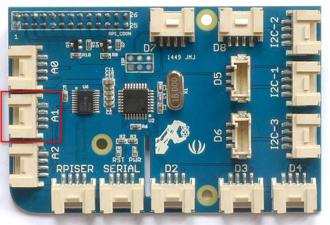
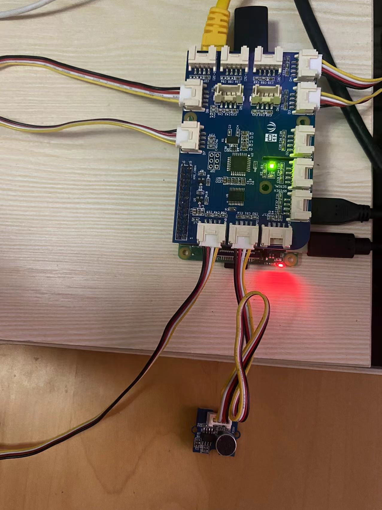
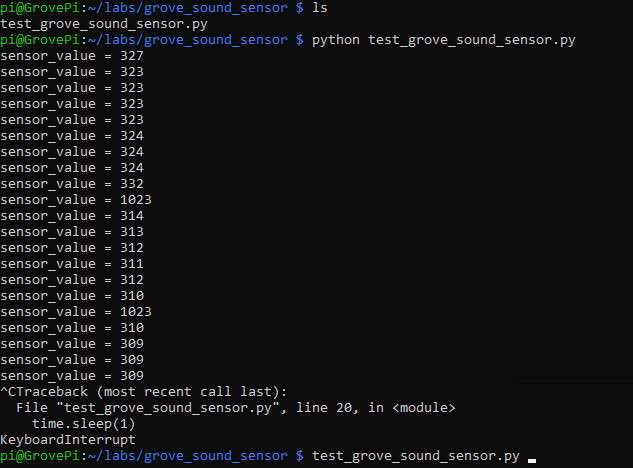

# Lab 2.f: Work with Grove Sound Sensor
---

## 1. Prerequisites

- Lab1 is completed. If you haven't, please do so.
- Raspberry Pi 3/4
- GrovePi+
- **Grove Sound Sensor**

  

    Grove Sound Sensor can detect the sound intensity of the environment. The main component of the module is a simple `microphone`, which is based on the L358 amplifier and an electret microphone. This module's output is analog and can be easily sampled and tested by a Seeeduino.

## 2. Connect Grove Sound Sensor to A1 port

Use the 4-pin cable to connect the Grove Sound Sensor to the `A1` port of GrovePi+.

  

  

## 3. Write some test codes and run

Create a directory and a file to store the codes.
```
$ mkdir ~/labs/grove_sound_sensor/
$ cd ~/labs/grove_sound_sensor/
$ touch test_grove_sound_sensor.py
$ nano test_grove_sound_sensor.py
```

Add below codes in the text editor.

```
# test Grove Sound Sensor
# by Tim Zhan

import time
import grovepi

# Connect the Grove Sound Sensor to analog port A0
# SIG,NC,VCC,GND
sound_sensor = 0

grovepi.pinMode(sound_sensor,"INPUT")

while True:
    try:
        # Read the sound level
        sensor_value = grovepi.analogRead(sound_sensor)

        print("sensor_value = %d" %sensor_value)
        time.sleep(1)

    except IOError:
        print ("Error")

```


Run the codes.
```
python test_grove_sound_sensor.py
```

Once running successfully, the sound value is displayed:




## 4. Reference codes

The sample test codes can be downloaded from [HERE](Grove_Sound_Sensor/test_grove_sound_sensor.py).


`<The END of Lab2.f>`
