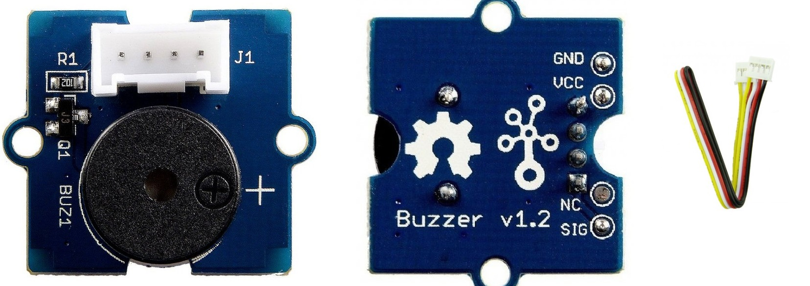
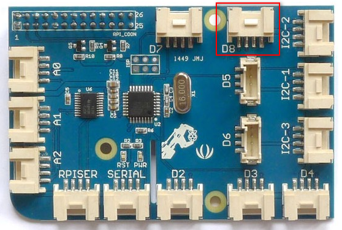
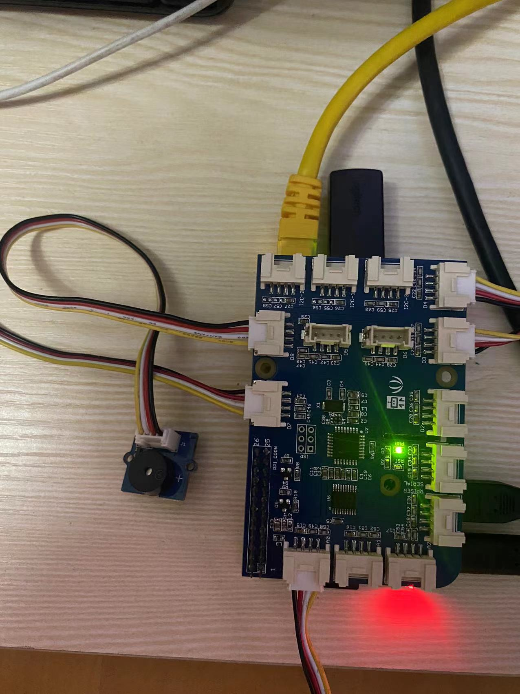
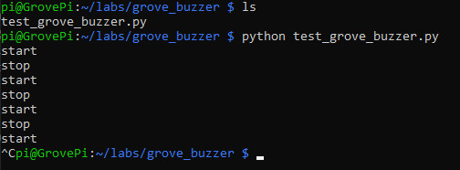

# Lab 2.g: Work with Grove Buzzer
---

## 1. Prerequisites

- Lab1 is completed. If you haven't, please do so.
- Raspberry Pi 3/4
- GrovePi+
- **Grove Buzzer**

  

    The Grove Buzzer module has a piezo buzzer as the main component. The piezo can be connected to digital outputs, and will emit a tone when the output is HIGH. Alternatively, it can be connected to an analog pulse-width modulation output to generate various tones and effects.

## 2. Connect Grove Buzzer to D8 port

Use the 4-pin cable to connect the Grove Buzzer to the `D8` port of GrovePi+.

  

  

## 3. Write some test codes and run

Create a directory and a file to store the codes.
```
$ mkdir ~/labs/grove_buzzer/
$ cd ~/labs/grove_buzzer/
$ touch test_grove_buzzer.py
$ nano test_grove_buzzer.py
```

Add below codes in the text editor.

```
# test Grove Buzzer
# by Tim Zhan

import time
import grovepi

# Connect the Grove Buzzer to digital port D8
# SIG,NC,VCC,GND
buzzer = 8

grovepi.pinMode(buzzer,"OUTPUT")

while True:
    try:
        # Buzz for 1 second
        grovepi.digitalWrite(buzzer,1)
        print ('start')
        time.sleep(1)

        # Stop buzzing for 1 second and repeat
        grovepi.digitalWrite(buzzer,0)
        print ('stop')
        time.sleep(1)

    except KeyboardInterrupt:
        grovepi.digitalWrite(buzzer,0)
        break
    except IOError:
        print ("Error")
```


Run the codes.
```
python test_grove_buzzer.py
```

Once running successfully, the buzzer will start to beep periodically. You may press Ctrl-C to exit.




## 4. Reference codes

The sample test codes can be downloaded from [HERE](Grove_Buzzer/test_grove_buzzer.py).


`<The END of Lab2.g>`
