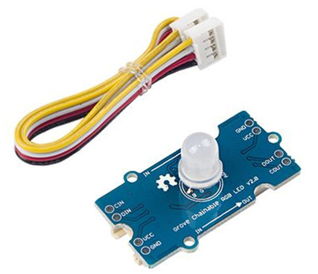
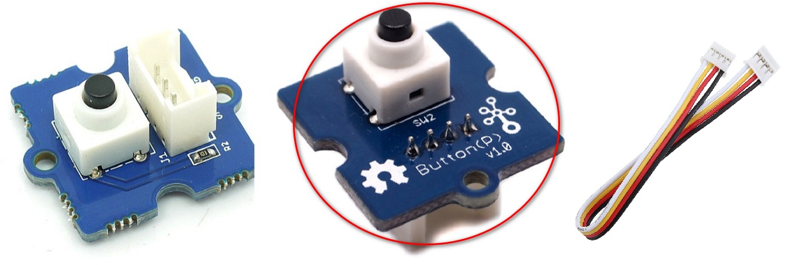
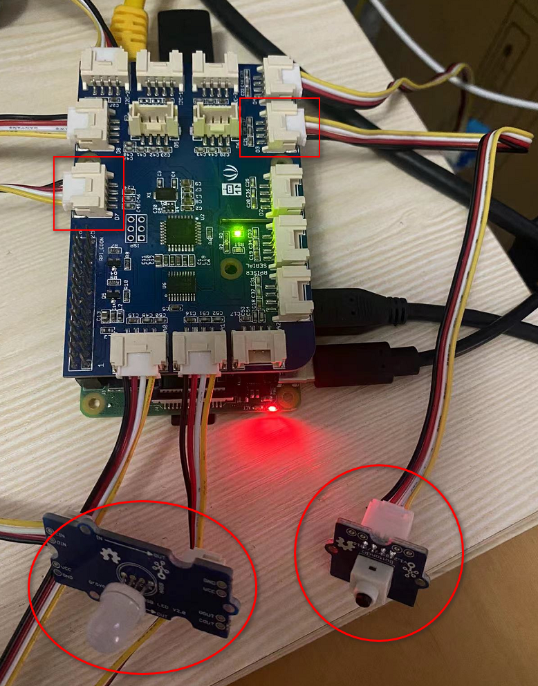
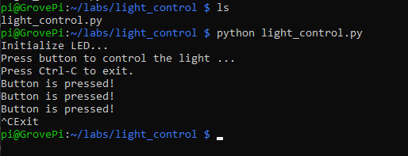

# Lab 3.a: Light Control
---

## 1. Prerequisites

- **Lab 1, Lab 2, Lab 2.a, Lab 2.g** are completed
- Raspberry Pi 3/4
- GrovePi+
- **Grove Chainable RGB LED**
  

- **Grove Button**
  


## 2. Connect the sensors to GrovePi+

Use the 4-pin cables to connect the Grove Chainable RGB LED to A`D7` port and to connect Grove Buzzer to the `D3` port of GrovePi+.



## 3. Write some test codes and run

Create a directory and a file to store the codes.
```
$ mkdir ~/labs/light_control/
$ cd ~/labs/light_control/
$ touch light_control.py
$ nano light_control.py
```

Add below codes in the text editor.

```
# Project 1: Light Control
# Use Grove Button to control the Grove Chainable RGB LED
# Press button once, the LED will flash from Red, to Green, then to Blue and finally to Black once
# by Tim Zhan

import time
import grovepi

# I have only one LED so just connect it to the D7 port of GrovePi
pin_led = 7
numleds = 1    #If you have x LEDs, change 1 to x.
grovepi.pinMode(pin_led,"OUTPUT")
time.sleep(1)

# Connect the Grove Button to digital port D3 of GrovePi
# SIG,NC,VCC,GND
pin_button = 3
grovepi.pinMode(pin_button,"INPUT")

# test colors used in grovepi.chainableRgbLed_test()
testColorBlack = 0   # 0b000 #000000
testColorBlue = 1    # 0b001 #0000FF
testColorGreen = 2   # 0b010 #00FF00
testColorRed = 4     # 0b100 #FF0000

# patterns used in grovepi.chainableRgbLed_pattern()
thisLedOnly = 0

# reset LED (all off)
print("Initialize LED... ")
print("Press button to control the light ...")
print("Press Ctrl-C to exit.")
grovepi.chainableRgbLed_test(pin_led, numleds, testColorBlack)
time.sleep(.5)

while True:
    try:
        result = grovepi.digitalRead(pin_button)
        if result == 1:
            print("Button is pressed!")

            # Turn Red
            grovepi.chainableRgbLed_test(pin_led, numleds, testColorRed)
            time.sleep(0.5)

            # Turn Green
            grovepi.chainableRgbLed_test(pin_led, numleds, testColorGreen)
            time.sleep(0.5)

            # Turn Blue
            grovepi.chainableRgbLed_test(pin_led, numleds, testColorBlue)
            time.sleep(0.5)

            # reset (all off)
            grovepi.chainableRgbLed_test(pin_led, numleds, testColorBlack)
            time.sleep(.5)

    except KeyboardInterrupt:
        print ("Exit")
        break

    except IOError:
        print ("Error")
```


Run the codes.
```
python light_control.py
```

Once running successfully, press the button and you will see the LED flash from Red to Green to Blue and then to Black. If you press again, it does the same. You may press Ctrl-C to exit.




## 4. Reference codes

The sample test codes can be downloaded from [HERE](Light_Control/light_control.py).


`<The END of Lab 3.a>`
