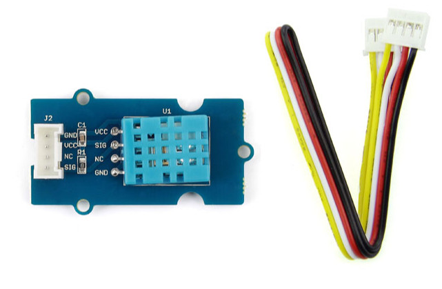
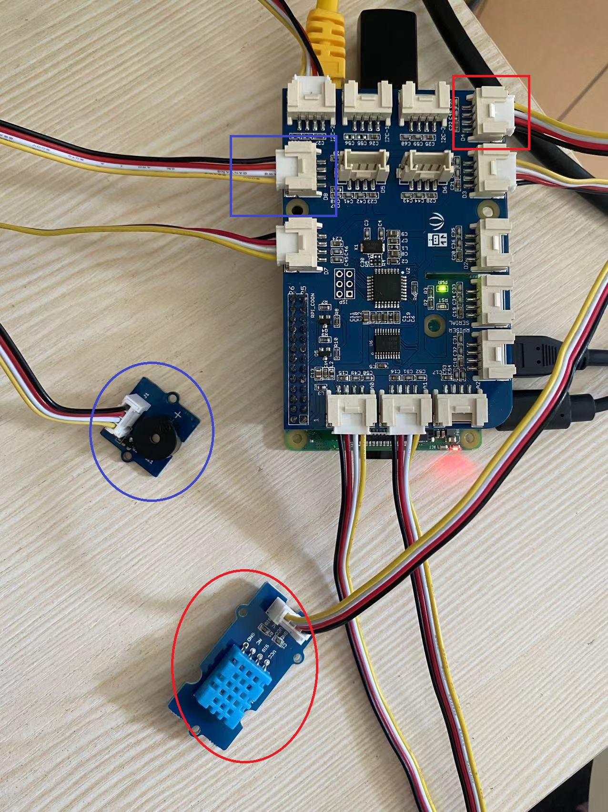
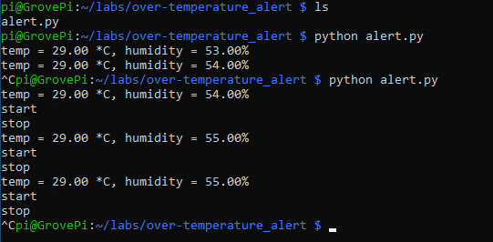

# Lab 3.b: Over-temperature Alert
---

## 1. Prerequisites

- Lab1 is completed. If you haven't, please do so.
- Raspberry Pi 3/4
- GrovePi+
- **Grove Temperature and Humidity Sensor (DHT11)**
  
- **Grove Buzzer**
  


## 2. Connect the sensors to GrovePi+

Use the 4-pin cables to connect the Grove Temperature&Humidity Sensor (DHT11) to to `D4` port and to connect Grove Buzzer to the `D8` port of GrovePi+.




## 3. Write some test codes and run

Create a directory and a file to store the codes.
```
$ mkdir ~/labs/over_temperature_alert/
$ cd ~/labs/over_temperature_alert/
$ touch alert.py
$ nano alert.py
```

Add below codes in the text editor.

```
# Project 2: Over-Temperature Alert
# When the temperature is over than a threshold, the buzzer will beep
# by Tim Zhan

import grovepi
import time
import math

# Connect the Grove Temperature & Humidity Sensor Pro to digital port D4
# This example uses the blue colored sensor.
# SIG,NC,VCC,GND
pin_dht11 = 4  # The Sensor goes on digital port D4.

# temp_humidity_sensor_type
# DH11 is the blue sensor
blue = 0    # DHT11
white = 1   # DHT Pro

# Set threshold for alert
threshold = 29 	# change to your own

# Connect the Grove Buzzer to digital port D8
# SIG,NC,VCC,GND
pin_buzzer = 8
grovepi.pinMode(pin_buzzer,"OUTPUT")

while True:
    try:
        # The first parameter is the port, the second parameter is the type of sensor.
        [temp,humidity] = grovepi.dht(pin_dht11,blue)  
        if math.isnan(temp) == False and math.isnan(humidity) == False:
            print("temp = %.02f *C, humidity = %.02f%%"%(temp, humidity))
	
	if temp >= threshold:	
            # Buzz for 1 second
            grovepi.digitalWrite(pin_buzzer,1)
            print ('start')
            time.sleep(1)

            # Stop buzzing for 1 second and repeat
            grovepi.digitalWrite(pin_buzzer,0)
            print ('stop')
            time.sleep(1)	

	time.sleep(5)

    except KeyboardInterrupt:
        grovepi.digitalWrite(pin_buzzer,0)
	break

    except IOError:
        print ("Error")

```

Run the codes.
```
python alert.py
```

To hit the threshold, you may want firstly to find out the current environment temperature. You can just set a test threshold like 32 in the codes and run the codes.

Once running successfully, your current envirnomental temperature, for instance 29 degrees, will be displayed, then you can change the threshold to that value like 29, and run the codes again. Then the buzzer will start to beep. You may press Ctrl-C to exit.




## 4. Reference codes

The sample test codes can be downloaded from [HERE](over_temperature_alert/alert.py).


`<The END of Lab3.b>`
