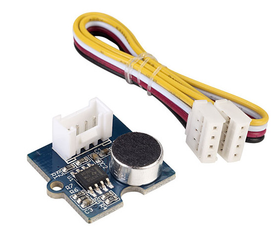
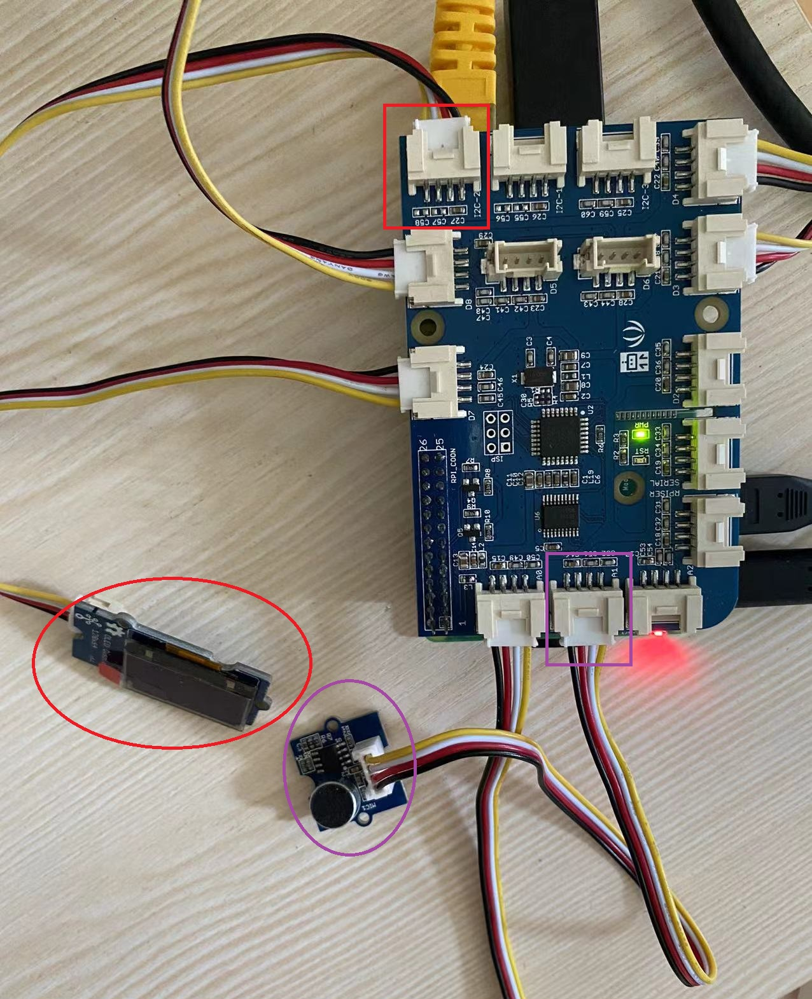
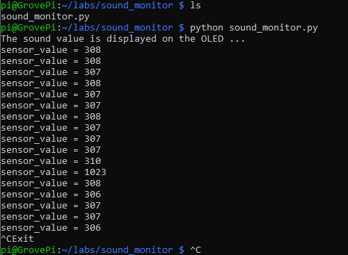
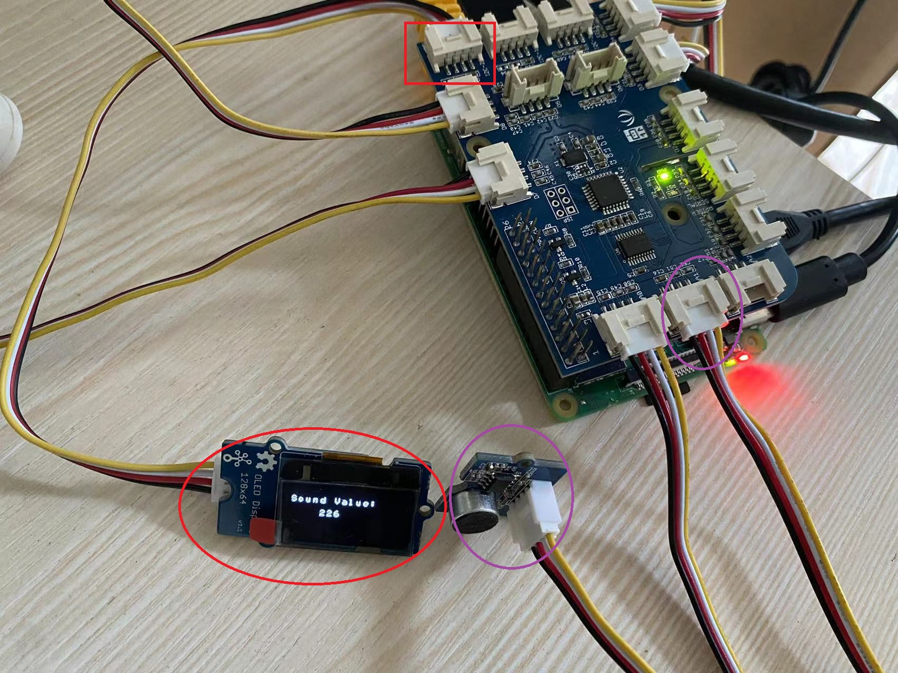

# Lab 3.c: Sound Monitor
---

## 1. Prerequisites

- Lab1 is completed. If you haven't, please do so.
- Raspberry Pi 3/4
- GrovePi+
- **Grove Sound Sensor**
  

- **Grove OLED Display**
 

## 2. Connect the sensors to GrovePi+

Use the 4-pin cables to connect the Grove Sound Sensor to to `A1` port and to connect Grove OLED Display to the `I2C-2` port of GrovePi+.




## 3. Write some test codes and run

Create a directory and a file to store the codes.
```
$ mkdir ~/labs/sound_monitor/
$ cd ~/labs/sound_monitor/
$ touch sound_monitor.py
$ nano sound_monitor.py
```

Add below codes in the text editor.

```

```


Run the codes.
```
python sound_monitor.py
```

Once running successfully, the sound value will be displayed on the OLED display. You may press Ctrl-C to exit.





## 4. Reference codes

The sample test codes can be downloaded from [HERE](Sound_Monitor/sound_monitor.py).


`<The END of Lab3.c>`
