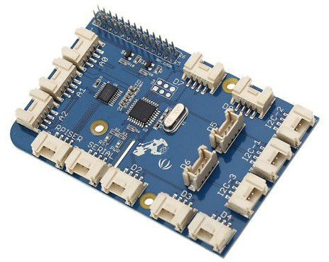

# Playing with GrovePi+ development board
---
GrovePi+ is a good extension board from [Dexter Industries](https://www.dexterindustries.com/grovepi/). 

GrovePi+ is supposed to work with a Raspberry Pi 3/4.  

Firstly, we will need to set up the development environment.

## [Lab 1 - Set up the development environment](Lab1-Set_up_dev_environment.md)

---

Then, we will start to connect the individual sensor each time and get it work with GrovePi so you can be familiar with GrovePi development.

This series of labs provide you a quick starter guide on how to develop with GrovePi Plus from scratch. 

## [Lab 2 - Connect IoT sensors to GrovePi](Lab2-Connect_IoT_sensors.md)

### [Lab 2.a - Grove Chainable RGB LED](Lab2.a-Grove_Chainable_RGB_LED.md)

### [Lab 2.b - Grove Temperature and Himidity Senosr](Lab2.b-Grove_Temperature_Humidity_Sensor.md)

### [Lab 2.c - Grove Light Sensor](Lab2.c-Grove_Light_Sensor.md)

### [Lab 2.d - Grove Button](Lab2.d-Grove_Button.md)

### [Lab 2.e - Grove OLED Display](Lab2.e-Grove_OLED_Display.md)

### [Lab 2.f - Grove Sound Sensor](Lab2.f-Grove_Sound_Sensor.md)

### [Lab 2.g - Grove Buzzer](Lab2.g-Grove_Buzzer.md)

---

With above labs completed, you are ready to do something interesting. In this series, I will try to connect multi sensors to simulate some simple IoT scenarios which can be a good start for your next-step study or PoC purpose.

## [Lab 3 - Simulate some IoT Scenarios](Lab3-Simulate_IoT_Scenarios.md)

### [Lab 3.a - Light Control](Lab3.a-Light_Control.md)

### [Lab 3.b - Over-Temperature Alert](Lab3.b-Over-temperature_Alert.md)

### [Lab 3.c - Sound Monitor](Lab3.c-Sound_Monitor.md)
---

`<END of Readme>`